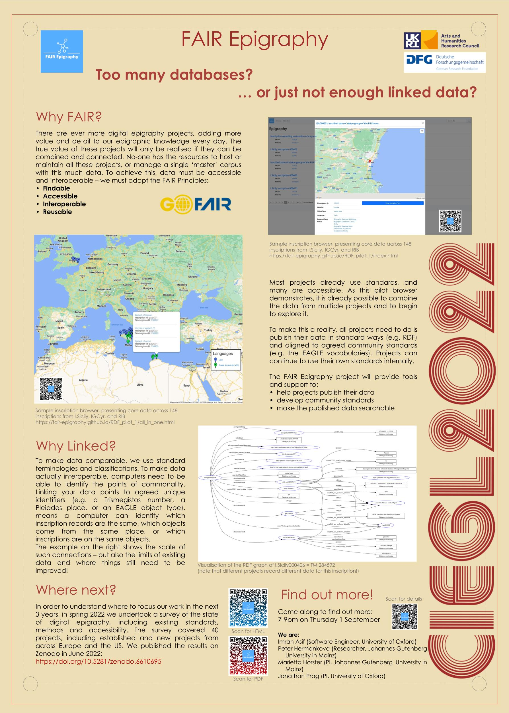

# The FAIR Epigraphy Project 

 The integration of digital humanities in the field of ancient history has generated major editorial and analytical epigraphic projects based on the diverse uses of writing in everyday life whether featured on amphora stamps for administrative usage and quality control, religiously motivated engravings in sanctuaries, Greco-Roman inscribed epitaphs, or even Pompeiian pornographic graffiti.  

At the same time, large digital datasets have opened the door to the application of new methods such as Machine Learning. Working with digital methods and making use of digital tools has opened our eyes to new approaches, allowing for innovative, unusual perspectives and interpretations of Greek and Roman history, economy, and culture. There exist several large (100,000+ texts) and many more small-scale epigraphic databases and corpora. The development of the EpiDoc TEI XML standard in the early 2000s has accelerated this work and inspired the first international efforts to network the many, excellent databases and to develop common minimum standards.

The overall desirability for FAIR (Findable, Accessible, Interoperable, Reusable) data is fundamental to advance research into the epigraphic, linguistic, and material culture of the ancient world. With the increase in Linked Open Data and novel interface technologies and standards, this project will be able to create the tools and the community needed to transform epigraphic research in the digital age. Our internationally collaborative approach will enable and support innovative research across epigraphic data, and the wider linked web of data (especially archaeological data), such that all epigraphic data is increasingly FAIR for both the research community and the wider public. To that end, we aim to (1) consolidate community-wide standards (vocabularies and ontology); (2) develop the tools for community implementation of those standards (vocabulary and ontology hosting and publication); (3) host and make fully accessible the resulting linked open data published by individual projects (RDF/XML data publication).

The project team, supported and backed by a dedicated community of epigraphers, will provide the advice and training to enable alignment with agreed standards by past, current, and future projects (technical and practical support, development of best-practice networks and training materials). The PIs and the team members will illustrate the cutting-edge research potential of epigraphic linked data and its integration into the wider web of data by publications and research on Greek and Roman history, culture, and economy.

The FAIR Epigraphy project will run for 36 months from 2022-2025, and is co-directed by Marietta Horster (Mainz, Germany) and Jonathan Prag (Oxford, UK).

## Funding

FAIR Epigraphy is supported by the Arts and Humanities Research Council (AHRC) [grant number AH/W010682/1]; and the Deutsche Forschungsgemeinschaft (DFG) [grant number 468455971].

## The team

* Imran Asif, , University of Oxford, imran.asif@classics.ox.ac.uk

* Petra Hermankova , Johannes Gutenberg University, petra.hermankova@uni-mainz.de, [@petrifiedvoices](https://github.com/petrifiedvoices)

* Marietta Horster , Johannes Gutenberg University in Mainz, Corpus Inscriptionum Latinarum/BBAW, horster@uni.mainz.de

* Jonathan Prag , University of Oxford, jonathan.prag@merton.ox.ac.uk

  

## More resources

### 1. Digital Epigraphy in 2022: report
- published at , as an interactive [HTML site](https://fair-epigraphy.github.io/scoping_survey_report/scripts/01_FAIR_epi_report.html), or [printable PDF](https://github.com/FAIR-epigraphy/scoping_survey_report/blob/main/scripts/01_FAIR_epi_report.pdf)

_This document maps the state of digital epigraphy in early 2022, with a focus on Open Science practices and accessibility of resources. The report is based on anonymised responses received during the digital survey circulating between February and April 2022, organised by the FAIR Epigraphy Project. The responses cover a broad spectrum of projects from Europe and the USA, ranging from well-established projects with relatively stable institutional support to short-term projects with a more narrow focus and limited access to IT support and funding. The results of the survey will be used to inform the planning of the FAIR Epigraphy project in the following three years. The report is fully reproducible (written in R programming language) and along with the anonymised data accessible via its own GitHub repository (https://github.com/FAIR-epigraphy/scoping_survey_report), and published through Zenodo._

### 2. Linking epigraphic resources demo (RDF) available at [https://inscriptiones.org/](https://inscriptiones.org/)

_Demo project linking digital epigraphic resources from partner projects in user friendly intreface. The purpose of this demo is to demonstrate the usefulness of Linked Open Data in epigraphy and relative ease of use, once you have the data in the right format (Typically Epidoc XML). Developed by Imran Asif for presentation at CIEGL 2022._

### 3. Provisional project website [https://www.csad.ox.ac.uk/fair-epigraphy](https://www.csad.ox.ac.uk/fair-epigraphy)

### 4. [Project's profile on GitHub](https://github.com/FAIR-epigraphy)

_Access to all FAIR Epigraphy digital resources in one place._

### 5. [Project's presentation at CIEGL 2022](../docs/CIEGL22_poster_FAIR.pdf)

_Who are we and what do we want to achieve in a nutshell_

  

---