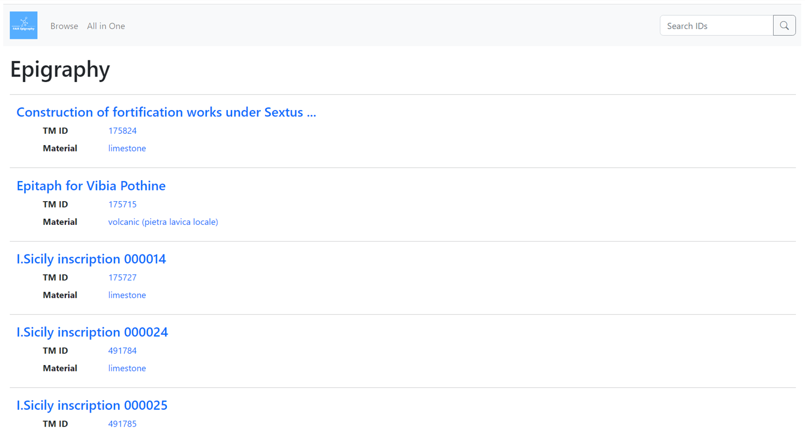
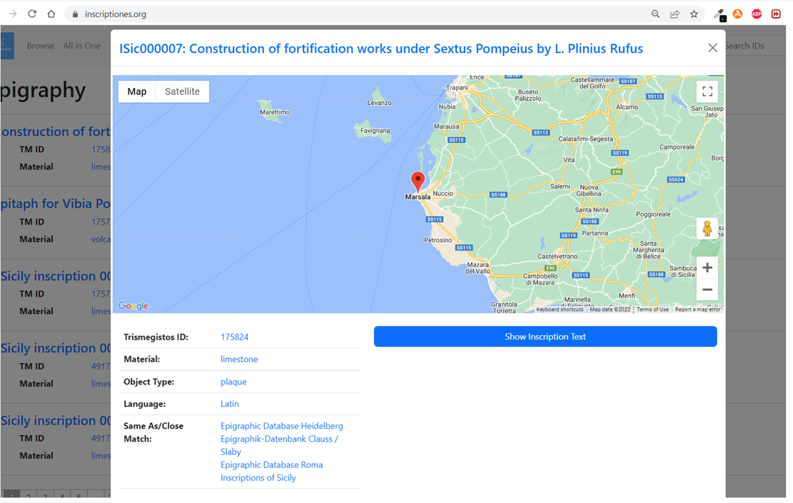
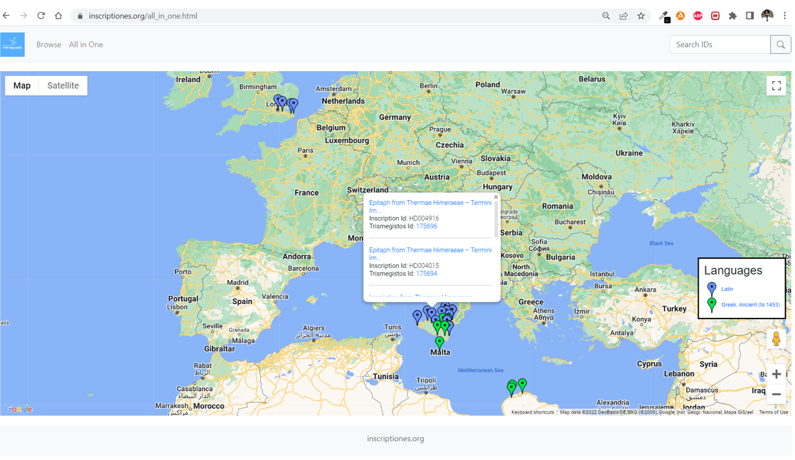

FAIR Epigraphy and the RDF Pilot
================================

The FAIR Epigraphy project aims to enable the epigraphy linked data cloud and facilitate interoperability in the epigraphic world. To achieve our goal, we need to make epigraphic data [FAIR (Findable, Accessible, Interoperable, Reusable)](https://www.go-fair.org/fair-principles/). With the increase in Linked Open Data and novel interface technologies and standards, this project will be able to create the tools and the community needed to transform epigraphic research in the digital age. Our internationally collaborative approach will enable and support innovative research across epigraphic data and the wider linked web of data, such that all epigraphic data is increasingly FAIR for both the research community and the wider public. To that end, we aim to

1.  Consolidate community-wide standards (vocabularies and ontology)
2.  Develop the tools for community implementation of those standards (vocabulary and ontology hosting and publication)
3.  Host and make fully accessible the resulting linked open data published by individual projects (RDF/XML data publication)

This website presents a pilot project intended to illustrate the potential of such an approach through a very simple illustration of what published linked data can enable (an example of (3) above), using existing published and publicly available epigraphic data.

FAIR-Epigraphy project is co-directed by [Marietta Horster (Mainz, Germany)](https://uni-mainz.academia.edu/MariettaHorster) and [Jonathan Prag (Oxford, UK)](https://www.classics.ox.ac.uk/people/dr-jonathan-prag). [Petra Hermankova](https://orcid.org/0000-0002-6349-0540) provides the research contributions with her experience in ancient history, digital epigraphy, and archaeology. [Imran Asif](https://csad.web.ox.ac.uk/people/dr-imran-asif) joined the team and built/developed the front-end and backend of the inscriptiones.org project.

Datasets
--------

The pilot project uses data from the following four publicly available epigraphic datasets:

*   [iSicily](http://sicily.classics.ox.ac.uk/)
*   [Epigraphische Datenbank Heidelberg](https://edh.ub.uni-heidelberg.de/home?lang=en)
*   [Greek Verse Inscriptions of Cyrenaica](https://igcyr.unibo.it/)
*   [The Roman Inscriptions of Britain](https://romaninscriptionsofbritain.org/)

For the purposes of the pilot, we display only a sample of 146 inscriptions drawn from across these four projects.

Approach
--------

This project makes visible and searchable the epigraphic data within these datasets which is interlinked with other datasets containing additional information about the inscriptions such as Name, Object Type, Material, Location, Trismegistos ID, Language, and Inscription Text. We achieve these tasks with the help of the following technologies.

*   Convert XML data to RDF using [xTriples](https://xtriples.lod.academy/index.html) templates
*   Develop the front-end side using [Bootstrap 5](https://getbootstrap.com/docs/5.0/getting-started/introduction/)
*   Enable the front-end using the backend with the help of JavaScript language

GUI (Graphical User Interface)
------------------------------

This pilot has two main pages (Browse, All in one). The Browse page displays all the inscription data with minimal information (Figure 1);

Figure 1: Browse Page

clicking on any inscription displays more detailed information about the inscription (Figure 2).

Figure 2: Detailed information about inscription

The All in One page shows all inscription data over the map; clicking on a map-marker generates a pop-up which will provide basic details and links to individual inscriptions. (Figure 3).

Figure 3: All in One Page

Contributors
------------

*   [Jonathan Prag (Oxford, UK)](https://www.classics.ox.ac.uk/people/dr-jonathan-prag)
*   [Marietta Horster (Mainz, Germany)](https://uni-mainz.academia.edu/MariettaHorster)
*   [Petra Hermankova](https://orcid.org/0000-0002-6349-0540)
*   [Imran Asif](https://csad.web.ox.ac.uk/people/dr-imran-asif)

### Source Code

* * *

